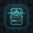

#  PedalCuad

What is PedalCuad?
---------------

**PedalCuad** is a minimalistic, touchscreen-optimized audio plugin host designed specifically as the "brain" for custom digital guitar pedal hardware. 

Originally forked from the powerful **Carla** project by falkTX, PedalCuad strips away the complex desktop UI elements (like traditional menu bars, tabs, and rack views) and focuses exclusively on a fullscreen **Patchbay** experience. It is designed to be controlled easily via a small touchscreen on a pedalboard.

Features
---------

* **Touch-Optimized UI:** No cluttered menus. A clean, fullscreen Patchbay with a left sidebar for plugin management.
* **Custom Parameter Drawer:** A modern, DAW-like parameter drawer with linear touch-friendly knobs and quick-access ON/OFF (Bypass) controls.
* **Plugin Support:** LADSPA, DSSI, LV2, VST2, VST3, and AU plugin formats.
* **OSC Remote Control:** Fully preserved Open Sound Control backend, allowing you to build companion mobile apps to control the pedal remotely.
* **Cross-Platform Base:** Runs natively on Linux (ALSA/PulseAudio/JACK), macOS, and Windows.
* **Independent Configuration:** Uses isolated configuration paths (`.config/PedalCuad`) to prevent conflicts with standard Carla installations.

Origin & License
----------

This project is a hardware-focused fork of [Carla](https://kx.studio/Applications:Carla) and inherits its powerful C++ audio engine.
It is open source and licensed under the GNU General Public License, version 2 or later.
